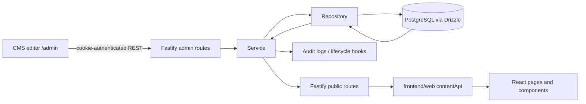

# Current Architecture Audit — iOrder

> Audit date: 2026-09-25. Scope is source inspection only. No source, schema, route, or migration was changed for this audit.

## 1. Repository overview

The repository is a **pnpm workspace monorepo**, not a Prisma application. Evidence:

- Root `package.json` declares `packageManager: pnpm@9.15.9` and workspace build/test scripts.
- `pnpm-workspace.yaml` includes `frontend/*` and `backend/*`.
- Database access is Drizzle ORM: `backend/database/drizzle.config.ts`, `backend/database/src/client.ts`, and schema files under `backend/database/src/schema/`. **There is no `schema.prisma` or Prisma client in this repository.**

```text
Repository
├── frontend/web       Public React 19 + Vite website
├── frontend/admin     React 19 + Vite CMS, served below /admin/
├── backend/api        Fastify 5 REST API
├── backend/contracts  Zod schemas + inferred TypeScript contracts
├── backend/database   Drizzle/PostgreSQL client, schema, migrations, seed/backup scripts
├── deploy             Docker Compose and Dockerfiles
└── storage            local-media development fallback
```

| Concern | Actual location / evidence |
| --- | --- |
| Public website | `frontend/web/src`, entry `frontend/web/src/main.jsx`, routes in `frontend/web/src/App.jsx` |
| CMS | `frontend/admin/src`, entry `frontend/admin/src/main.tsx`, route resolution in `frontend/admin/src/AdminApp.tsx` |
| API | `backend/api/src/server.ts` and registration in `backend/api/src/app.ts` |
| Shared types | `backend/contracts/src/index.ts` exports Zod-first contracts consumed by API/admin; web consumes selected contracts |
| Database | `backend/database/src/schema/index.ts`; Postgres/Drizzle, migrations in `backend/database/migrations` |
| Local dev topology | `frontend/web/vite.config.js`: web proxies `/admin` to 5174 and `/api`, `/media` to Fastify on 4000 |
| Production topology | `deploy/docker-compose.yml`: Postgres + MinIO + Fastify API + web container; migrations run as a service |
| Environment | `.env.example`, `backend/api/src/env.ts`, `backend/database/drizzle.config.ts`; secrets are environment variables, not captured here |

The web app owns the public React rendering. The API owns persistence/validation and can also serve the built public/admin SPAs when `SERVE_STATIC_FILES` is enabled (`backend/api/src/app.ts`).

## 2. Current data flow



The route registrations are centralized in `backend/api/src/app.ts`. Public web requests are concentrated in `frontend/web/src/utils/contentApi.js`; it uses a five-minute in-memory/session cache for most public content, except sales equipment and preview data.

## 3. Website architecture and route inventory

`frontend/web/src/App.jsx` lazy-loads all major routes. `PageLayout` (`frontend/web/src/components/PageLayout.jsx`) supplies shared header/footer; it does not itself fetch page data.

| Public route | Entry page | Primary renderer / sections | Actual data source | SEO source |
| --- | --- | --- | --- | --- |
| `/` | `pages/Home.jsx` | bespoke homepage sections | `/api/public/homepage`, plus public partners/posts/testimonials/offerings; static fallbacks | homepage CMS SEO if loaded, otherwise hardcoded values via `setPageSeo` |
| `/phan-mem` | `pages/SoftwarePage.jsx` | bespoke editorial listing | `/api/public/offerings?type=software`, fallback `data/siteContent.js` | hardcoded |
| `/phan-mem/:slug` | `pages/SoftwareDetail.jsx` | `detail/SectionRenderer.jsx` | `/api/public/offerings/software/:slug`; fallback static route data | record SEO with fallback |
| `/giai-phap` | `pages/SolutionsPage.jsx` | `ListingHero` plus bespoke listing/comparison | public offerings `solution`, fallback static | hardcoded |
| `/giai-phap/:slug` and `/giai-phap/:section/:slug` | `pages/SolutionDetail.jsx` | `SectionRenderer` | public offering `solution`, fallback static | record SEO with fallback |
| `/dich-vu` | `pages/ServicesPage.jsx` | `ListingHero` plus bespoke cards | public offerings `service`, fallback static | hardcoded |
| `/dich-vu/:slug` and `/dich-vu/:section/:slug` | `pages/ServiceDetail.jsx` | `SectionRenderer` | public offering `service`, fallback static | record SEO with fallback |
| `/nganh-hang/:slug` | `pages/IndustryDetail.jsx` | `SectionRenderer` or static fallback | public offering `industry`, fallback `data/industrySolutions.js` | record SEO with fallback |
| `/thiet-bi` | `pages/SalesEquipmentPage.jsx` | group/card/catalog/detail renderer | `/api/public/sales-equipment` | hardcoded page metadata |
| `/tin-tuc` | `pages/NewsPage.jsx` | bespoke article list/filtering | `/api/public/posts`, fallback `data/newsArticles.js` | hardcoded |
| `/tin-tuc/:slug` | `pages/NewsDetail.jsx` | bespoke article detail | `/api/public/posts/:slug`, related `/api/public/posts`, fallback static | record SEO with fallback |
| `/huong-dan`, `/huong-dan/:slug` | `pages/GuidesPage.jsx`, `GuideDetail.jsx` | guide listing/detail | posts API filtered to type `guide` | record SEO |
| `/ho-tro/cai-dat` | `pages/ToolsDownloadPage.jsx` | download list + fixed support copy | `/api/public/downloads` | hardcoded |
| `/ho-tro/:slug`, `/gioi-thieu`, `/terms`, static solution/service aliases | `pages/StaticPage.jsx` | generic hero/body/CTA | `/api/public/content-pages/*`, then static `pages` map in the same file | CMS SEO or static values |
| `/lien-he` | `pages/ContactPage.jsx` | fixed form | `POST /api/public/contact` | hardcoded |
| `/privacy-policy` | `pages/PrivacyPolicyPage.jsx` | static content | code / app-specific content | hardcoded |

Header data is mixed: `Header.jsx` gets menus from `/api/public/menus/main-nav` and offerings from public APIs, but retains `FALLBACK_NAV`; it has a code insertion to ensure `/thiet-bi` appears. Footer contact information is CMS-driven through `useSiteContact`, while its product/solution/service/support link lists are code constants in `Footer.jsx`.

## 4. Homepage deep dive

### Trace

```text
Route / in App.jsx
→ Home in frontend/web/src/pages/Home.jsx
→ fetchHomepage / fetchHomepagePreview in utils/contentApi.js
→ GET /api/public/homepage[/preview] in homepage-routes.ts
→ HomepageService.getPublicHomepage / getPreviewData
→ HomepageRepository (pages, page_blocks, page_revisions, media_assets)
→ PostgreSQL
```

Admin editing follows `HomepageEditor.tsx` → `frontend/admin/src/api.ts` → homepage admin routes → `HomepageService`. The service validates the Zod union `homepageInputSchema` from `backend/contracts/src/pages.ts`, checks referenced media, performs optimistic draft-version checks, writes revision snapshots, and writes audit records. The only true live preview implementation is homepage preview: signed token plus iframe `postMessage` between `HomepageEditor.tsx` and `Home.jsx`.

### Exact rendered sequence in `Home.jsx`

| Order | Section | Content source | Layout source | CMS editable now | Notes / risk |
| --- | --- | --- | --- | --- | --- |
| 1 | `home_hero` | CMS block or `heroSlides` / JSX defaults | `Home.jsx`, `styles/pages/home.css` | Yes | CMS controls text, CTA, slides and section appearance; JSX still dictates structure and commitment line. |
| 2 | `home_stats` partner strip | Partners collection first; historic block partner data; `partnerItems` fallback | `Home.jsx` | Partly | Heading/limit from homepage block; logos best managed by Partners module. Stats field exists in contract but the current renderer presents partner strip, not a visible numeric stat set. |
| 3 | Operating outcomes / about | JSX strings, `dashboardLaptop` and Lucide icons | `Home.jsx` | No | Always rendered. In CMS mode it sets `order: blockOrder('home_hero')`, so it is not represented by a dedicated homepage block. |
| 4 | `home_industries` | CMS block or `data/industrySolutions.js` | `Home.jsx` | Yes, block fields | Icon mapping remains code (`getItemIcon`). |
| 5 | `home_features` | CMS block or `featureTabs` | `Home.jsx` | Yes, block fields | UI tabs, icon selection, interaction and fallback icon behavior are code. |
| 6 | `home_testimonials` | Testimonials collection first; historic block data; `staticTestimonials` fallback | `Home.jsx` | Partly | Block controls heading/limit; testimonial records are separately CMS managed. |
| 7 | `home_ecosystem_services` | CMS block or offering-derived/static fallback | `Home.jsx` | Yes | Component resolves offerings into groups; visual presentation is fixed. |
| 8 | `home_process` | CMS block or JSX defaults / local images | `Home.jsx` | Yes | Text, models, feature media, steps and appearance are structured in contract. |
| 9 | `home_featured_posts` | Posts API or `newsArticles` fallback; heading/filter config from CMS block | `Home.jsx` | Partly | CMS block selects type/limit/headings; article card implementation remains code. |
| 10 | `home_faq` | CMS block or `faqItems` fallback | `Home.jsx` | Yes | Current render slices to four entries even though contract allows 20. |
| 11 | `home_cta` | CMS block or JSX defaults | `Home.jsx` | Yes | CTA content and appearance controlled by CMS; markup fixed. |

`HOMEPAGE_SECTION_ORDER` and the discriminated block contracts live in `backend/contracts/src/pages.ts`. `HomepageRepository.normalizeBlocks` allows the saved order and filters unknown/duplicate types (`backend/api/src/modules/homepage/homepage.repository.ts`); it is a fixed catalogue of ten block types, not a generic Page Builder.

## 5. CMS architecture

### Admin routing and UI

- Admin route selection: `frontend/admin/src/AdminApp.tsx` maps pathname section to `keyBySlug` from `frontend/admin/src/sidebar/navigation.ts`.
- Sidebar groups: Overview; **Nội dung website**; **Thành phần dùng chung**; **Cấu hình website**.
- Managers are lazy-loaded in `AdminApp.tsx`; `OfferingsManager` is reused with type `software`, `solution`, `service`, and `industry`.
- Shared editor primitives exist in `frontend/admin/src/content-editor/ContentEditorPage.tsx`: `ContentEditorPage`, `ContentListPage`, `PublishSidebar`, `SeoMetaCard`, `CoverImageCard`, `CategoryTagSelector`, and `ContentItemCard`.
- `PostsManager`, `OfferingsManager`, and `ContentPagesManager` consume that shared editor. `HomepageEditor` and `SalesEquipmentManager` use their own feature-specific editing surfaces.
- Rich text is Tiptap through `frontend/admin/src/RichTextEditor.tsx`; media selection comes from `ImagePicker` in `frontend/admin/src/ui.tsx` and `MediaLibrary.tsx`.

### Existing admin modules

| Sidebar / manager | API family | Database tables | Public consumer |
| --- | --- | --- | --- |
| Homepage editor | `/api/admin/homepage` | `pages`, `page_blocks`, `page_revisions` | `Home.jsx` |
| Software / solutions / services / industries | `/api/admin/offerings` | `offerings`, `offering_revisions` | listing/detail pages and header dropdowns |
| Sales equipment | `/api/admin/sales-equipment` | `sales_equipment`, `sales_equipment_revisions` | `SalesEquipmentPage.jsx` |
| Posts / guides | `/api/admin/posts`, `/api/admin/categories` | `posts`, `post_revisions`, categories/tags joins | News/guide pages |
| Content pages | `/api/admin/content-pages` | `content_pages` | `StaticPage.jsx` |
| Media | `/api/admin/media` | `media_assets` plus storage backend | consumed by media references |
| Partners | `/api/admin/partners` | `partners` | Homepage partner strip |
| Testimonials | `/api/admin/testimonials` | `testimonials` | Homepage testimonial section |
| Downloads | `/api/admin/downloads` | `support_downloads` | `ToolsDownloadPage.jsx` |
| Navigation | `/api/admin/menus`, `/api/admin/link-groups` | `menus`, `menu_items`, `link_groups`, `content_links` | Header reads `main-nav`; footer link groups are not consumed by `Footer.jsx` currently |
| Site profile / links / appearance | `/api/admin/settings/*` | `site_profile`, `site_settings` | Footer contact and `App.jsx` appearance |
| Leads | `/api/admin/leads` | `contact_leads` | admin-only operational data |
| Activity / users | `/api/admin/activity`, `/api/admin/users` | `audit_logs`, identity tables | admin-only |

Authentication is session-cookie based. `createAuthGuard` in `backend/api/src/auth/auth-guard.ts` applies `admin` or `editor` roles for content modules; some operational modules use `admin` only. No granular per-content permission model was found.

## 6. Backend, API, and publish flow

The backend is Fastify with a repository/service/routes module structure under `backend/api/src/modules`. Runtime validation is primarily Zod contracts from `@iorder/contracts`; route handlers use `safeParse` before service calls. Public routes generally list published records; admin routes are cookie guarded.

| Module | Route adapter | Service / repository | DB model | Public API | Admin API / lifecycle |
| --- | --- | --- | --- | --- | --- |
| Homepage | `homepage-routes.ts` | `HomepageService` / `HomepageRepository` | pages + blocks + revisions | `/api/public/homepage`, preview | autosave, checkpoint, publish, revisions, restore |
| Offerings | `offerings-routes.ts` | `OfferingsService` / repository | offerings + revisions | `/api/public/offerings` | CRUD, publish, archive, unpublish |
| Posts | `posts-routes.ts` | `PostsService` / repository | posts + revisions + taxonomy | `/api/public/posts` | CRUD, publish/archive/unpublish, revisions/restore, scheduled publish |
| Sales equipment | `sales-equipment-routes.ts` | `SalesEquipmentService` / repository | sales equipment + revisions | `/api/public/sales-equipment` | CRUD, publish/archive/unpublish, revisions/restore |
| Content pages | `content-pages-routes.ts` | `ContentPagesService` / repository | content pages | `/api/public/content-pages/*` | CRUD, publish/unpublish; no revision endpoint |
| Navigation | `navigation-routes.ts` | `NavigationService` / repository | menus/links | menus + link-groups | create/update/delete menu/link records |
| Media | `media-routes.ts` | `MediaService` / repository | media assets | media URL served locally/MinIO | upload/update/usage/delete |
| Settings | `settings-routes.ts` | `SettingsService` / repository | profile/settings JSON | `/api/public/settings` | profile/external links/appearance |
| Partners/testimonials/downloads | respective routes/services | repositories | respective tables | list public | CRUD enable/order data |

Publish status uses PostgreSQL enum values `draft`, `review`, `scheduled`, `published`, `archived` (`backend/database/src/schema/enums.ts`), but public contracts intentionally expose the active managed subset `draft`, `published`, `archived` (`backend/contracts/src/content.ts`). Posts support scheduled publication through `scheduledAt` and `shared/scheduler/post-scheduler.ts`. Homepage has its own draft-version/revision snapshot flow. Offerings and equipment have revision tables, but their currently exposed admin API differs from homepage/posts (no common preview implementation).

### Preview and multilingual architecture

- **Preview:** homepage is the only end-to-end tokenized draft preview. `HomepageService.createPreviewToken` creates a ten-minute token; `Home.jsx` listens to iframe `postMessage` in preview mode. Posts/content pages have actions labeled preview that open public paths; this is not a protected draft rendering protocol. `ContentEditorPage` provides a Google SEO preview only.
- **Multilingual:** no locale column, translation table, locale-aware routing, locale request parameter, or i18n provider was found. `utils/seo.js` sets `og:locale` to `vi_VN`; content is Vietnamese-first.

### SEO and media architecture

- SEO fields repeat on pages, offerings, posts, content pages, and equipment (`seoTitle`, `seoDescription`, `canonicalUrl`). The public client uses `setPageSeo` in `frontend/web/src/utils/seo.js` to mutate browser meta tags. Sitemap/robots are produced by `backend/api/src/seo/seo-routes.ts`.
- Media is a first-class table (`media_assets`) with local or MinIO storage selected in `backend/api/src/app.ts`. Assets store URL, MIME type, dimensions, alt text and caption. Most domain records reference media by UUID. `MediaService.getUsage` prevents delete while known references exist; usage contract currently enumerates homepage section, post, offering, partner, testimonial and site profile, so equipment/content-page coverage must be verified before relying on it as exhaustive.

## 7. Database architecture

All IDs are UUID with database `uuid_v7()` defaults through `uuidV7Default` in `backend/database/src/schema/shared.ts`. UUID is the primary key; there is no separate numeric primary key in the current schema.

| Group | Tables / notes |
| --- | --- |
| Domain/content | `pages`, `page_blocks`, `page_revisions`; `offerings`, `offering_revisions`; `sales_equipment`, `sales_equipment_revisions`; `content_pages`; `posts`, `post_revisions`, categories/tags joins |
| Marketing/shared | `partners`, `testimonials`, `support_downloads` |
| Navigation/SEO/system | `menus`, `menu_items`, `link_groups`, `content_links`; `site_profile`, `site_settings`, `redirects` |
| Media | `media_assets` |
| Identity/audit | `users`, `roles`, `user_roles`, `sessions`; `audit_logs` |
| Leads | `contact_leads` |

### JSON usage and relations

| JSON column | Current structured payload | Contract |
| --- | --- | --- |
| `page_blocks.data`, `page_blocks.appearance` | homepage block content and visual settings | discriminated `homepageBlockSchema` plus `sectionAppearanceSchema` |
| `page_revisions.content_snapshot` | full serialized homepage snapshot | `homepageResponseSchema` |
| `offerings.content_json`, `offering_revisions.content_snapshot` | offering detail sections, FAQ, metrics, links | `offeringContentSchema`, `offeringSectionSchema` |
| `posts.content_json` | generated/legacy body representation; `posts.content_html` also exists | public/admin post contract uses string `body` |
| `post_revisions.content_snapshot` | serialized post snapshot | `postResponseSchema` |
| `sales_equipment.specification_groups`, revisions | group title + list of specification strings | `equipmentSpecificationGroupSchema` |
| `site_settings.value` | `external_links`, `appearance` objects | defaults are defined in settings repository; public contract currently omits `appearance` despite web use |
| `audit_logs.before_data`, `after_data` | mutation audit snapshots | intentionally generic |

Important relations include media foreign keys on offerings/posts/equipment/partners/testimonials/profile/downloads; revisions reference the source record and editor; posts use many-to-many categories and tags. Slug uniqueness is enforced for active pages, posts, offerings, and equipment. `content_pages` has a unique slug and publish timestamp but no revisions. No translations are persisted.

## 8. CMS ↔ API ↔ DB ↔ website mapping

See the complete feature matrix in [CONTENT_MAPPING_MATRIX.md](CONTENT_MAPPING_MATRIX.md). The important mismatch pattern is intentional fallback: public pages continue rendering static source when their API request fails or returns no item. That protects availability but means a CMS record does not yet make every adjacent editorial string configurable.

## 9. Hardcoded content inventory

### Must migrate before a general Content Studio claims full editorial control

- Homepage operating-outcomes/about section, hero commitment line, testimonial intro, FAQ CTA, and many fallback sections: `frontend/web/src/pages/Home.jsx`.
- Editorial hero copy, proof bullets, comparison copy and support sections on listing pages: `SoftwarePage.jsx`, `SolutionsPage.jsx`, `ServicesPage.jsx`, `ToolsDownloadPage.jsx`.
- Footer product/solution/service/support/company link columns and DMCA URL: `frontend/web/src/components/Footer.jsx`.
- Contact page copy, privacy-policy text, static placeholder/detail copy, and static-page fallbacks: `ContactPage.jsx`, `PrivacyPolicyPage.jsx`, `StaticPage.jsx`.

### Should migrate when that page becomes a managed marketing surface

- Fallback catalogs in `frontend/web/src/data/siteContent.js`, `newsArticles.js`, and `industrySolutions.js`.
- `Header.jsx` fallback nav/support behavior. Keep a safe fallback, but source canonical navigation from CMS once migration is complete.
- Listing-page headings and fixed visual asset choices.

### Can stay in code

- React component selection, icon mapping, CSS classes, animation/intersection-observer behavior, responsive breakpoints, API implementation, authentication, media storage driver, and fallback behavior.

## 10. Component contract and CMS/frontend coupling

See [COMPONENT_CONTRACT_AUDIT.md](COMPONENT_CONTRACT_AUDIT.md) for props and safe-change boundaries.

| Coupling | Level | Evidence / consequence |
| --- | --- | --- |
| Homepage `block.type` and each block `data` | High | `Home.jsx` branches directly on fixed types and field names defined in `contracts/pages.ts`. Changing field names/types or adding an unsupported type requires contract, API, and renderer work. |
| Offering `sections[].type`, `variant`, visual enum values | High | `SectionRenderer.jsx` switches on types and generates CSS class names from variants. CSS/JSX refactors are safe only when these values and semantics remain stable. |
| Static page `body` raw HTML | High | `StaticPage.jsx` renders `dangerouslySetInnerHTML`; rich-text HTML shape/sanitization is a content contract and a security review concern. Guides/news detail render HTML similarly. |
| CMS fields/FE mapped shapes | Medium | Web `normalizeOffering` and `normalizeCmsPost` adapt API DTOs. Contracts are shared with admin/API, but web also has untyped JS adapters and static fallback objects. |
| Navigation menu vs special header dropdowns | Medium | Menu labels/order are CMS-driven, but `Header.jsx` treats offering URLs and support menu specially, and injects equipment if absent. |
| Appearance setting response | Medium | `App.jsx` reads `data.appearance`; `SettingsService.getPublicSettings` returns it, but `publicSettingsResponseSchema` in `contracts/settings.ts` does not declare it. This is a contract drift risk. |
| Internal CSS/markup | Low if fields preserved | Styling or markup can change without CMS data migration where component input contract stays the same. |

No evidence was found that CMS stores React component names, CSS class names, or arbitrary frontend JSX. CMS does store presentation enums: homepage background/fit/overlay/focal point and offering section `variant`, `background`, `container`, `alignment`, `spacing`. These are validated, but they still couple published content to supported renderer variants.

## 11. Risks and technical debt relevant to Content Studio

1. **Mixed content sources — high editorial risk, not a data-loss risk.** Many pages use CMS/API as preferred input and code as fallback. Editors cannot know from one place which visible strings remain code-owned.
2. **Homepage has a fixed block catalogue.** It is structured and validated, but cannot safely accept arbitrary blocks without extending contracts, renderer and editor together.
3. **Preview is inconsistent.** Homepage has protected draft preview; other managers mostly expose public-preview links or SEO preview.
4. **Lifecycle/revision coverage is inconsistent.** Homepage/posts have rich revision APIs; equipment has revisions but a different surface; offerings have revision storage but no corresponding admin revision endpoints in the audited routes; content pages have no revisions.
5. **Raw HTML exists.** `content_pages.body`, posts/guides rich content flow to `dangerouslySetInnerHTML`. This must remain a deliberate, sanitized rich-text contract rather than becoming arbitrary page configuration.
6. **Navigation is only partially authoritative.** Header is hybrid; Footer link columns ignore the link-group API at render time.
7. **No multilingual model.** Do not add language UI before locale/storage/public routing contracts exist.
8. **Some module-standard gaps should be verified separately.** Navigation mutates menu/link records in `NavigationService` without visible audit-log calls; shared managers have inconsistent lifecycle behavior. This is factual source observation, not a recommendation to change it inside this audit.

### Blockers before Page Builder

- Define a stable public render contract for every candidate block; `SectionRenderer` and homepage blocks are currently separate vocabularies.
- Decide how rich text is sanitized/versioned before generic pages are expanded; raw HTML cannot be treated as unstructured safe content.
- Standardize preview and revision semantics across content types, or explicitly scope the first Content Studio release to types that already have them.
- Inventory/migrate editorial hardcoded copy for the first managed screens; do not launch a “full CMS” claim while code fallbacks remain primary content.
- Resolve the settings public-contract drift around `appearance`.

## 12. Recommended direction after audit (no implementation in this change)

### KEEP

- pnpm workspace boundaries, `@iorder/contracts`, Fastify route/service/repository structure, Drizzle/Postgres schema, UUIDv7 defaults, media storage, session auth, audit table, and existing domain modules.
- `ContentEditorPage` primitives and `RichTextEditor`; they already provide a reusable foundation for an editor shell.
- Homepage structured blocks and offering section contracts as **two proven, bounded formats**, not as an automatic universal builder.

### EXTEND

- Admin information architecture: present content types inside a unified Content Studio while preserving current APIs/modules behind it.
- A common, explicit publish/revision/preview capability model that tells the UI which actions each content type supports.
- A content-source inventory/ownership label so editors can see CMS-managed, collection-driven, and code fallback regions.

### REFACTOR LATER

- Consolidate duplicated listing/editor UX around `ContentEditorPage` after behavior is documented and tested.
- Replace static marketing fallback copy page by page after the corresponding structured CMS contract is established.
- Unify homepage and offering presentation vocabularies only after deciding the smallest shared block set.

### DO NOT TOUCH AS PART OF A FIRST UI RESTRUCTURE

- Business-critical auth/session implementation, media storage mechanics, public URL/slugs, database data shape, and existing published renderer contracts.

## 13. Answers requested

1. **Actual architecture:** pnpm monorepo with React/Vite web and admin, Fastify REST API, shared Zod contracts, Drizzle/Postgres, Docker Compose deployment.
2. **Data flow:** CMS → authenticated admin API → service/repository → PostgreSQL → public API → `contentApi` → React renderer; shown above.
3. **Hardcoded content:** homepage about/CTA fragments, listing-page marketing copy, footer links, static pages/policy/contact and all fallbacks; detailed in section 9.
4. **CMS controls:** homepage blocks, offerings, equipment, posts/guides, content pages, media, partners, testimonials, downloads, menus, settings, leads, users/activity.
5. **CMS does not fully control:** several fixed marketing sections, footer links, static policy/contact copy, all layout implementation, and universal preview/revision.
6. **Coupling level:** medium overall; high for homepage and offering structured payload types, high for HTML body renderers.
7. **Safe FE redesign today:** CSS, JSX hierarchy, responsive behavior and animation are safe when component input contracts and semantic behavior remain unchanged.
8. **Breaking changes:** API DTO, Zod field/type, block/section type, variant value, media reference convention, slug/status lifecycle, or raw HTML format changes.
9. **Reusable Content Studio pieces:** contracts package, existing module services/repositories, `ContentEditorPage`, `PublishSidebar`, `SeoMetaCard`, media picker/library, audit/revision models and homepage preview pattern.
10. **Next step:** agree the first Content Studio scope and canonical content contracts, then prototype its admin shell around the existing module APIs; no database rewrite is justified before that decision.
