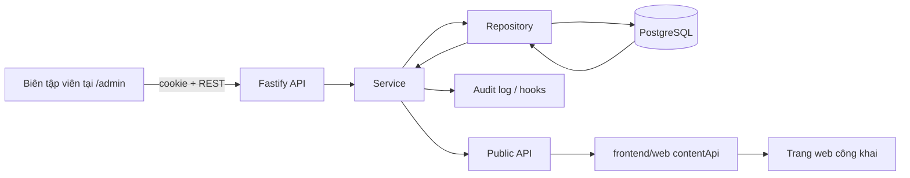

# Hướng dẫn để thực sự hiểu iOrder Website

Tài liệu này dành cho người mới tiếp quản dự án. Mục tiêu không phải là nhớ mọi
file, mà là trả lời được bốn câu hỏi sau:

1. Người dùng thao tác ở đâu và giao diện nào trả kết quả?
2. Dữ liệu đi qua những lớp nào trước khi được lưu hoặc hiển thị?
3. Muốn thay đổi một tính năng thì cần sửa những phần nào?
4. Phần nào là nội dung CMS, phần nào vẫn là giao diện/nội dung trong code?

> Phiên bản tài liệu: 2026-09-25. Hãy đọc cùng code, không coi đây là nguồn
> thay thế cho contract và test.

## 1. Bức tranh 5 phút

iOrder Website là một CMS marketing độc lập với hệ thống POS. Đây là pnpm
monorepo gồm năm package chính:

```text
Trình duyệt khách       frontend/web       React 19 + Vite
Trình duyệt biên tập    frontend/admin     React 19 + Vite
REST API                backend/api        Fastify 5 + TypeScript
Hợp đồng dữ liệu        backend/contracts  Zod + TypeScript types
Lưu trữ                 backend/database   Drizzle ORM + PostgreSQL
```

Luồng quan trọng nhất là:



Nguyên tắc cần nhớ: **contract trước, route mỏng, service xử lý nghiệp vụ,
repository mới được chạm Drizzle**. Public web không đọc PostgreSQL trực tiếp.

## 2. Chạy dự án và xác nhận hệ thống sống

Yêu cầu: Node.js 22+, pnpm 9 và PostgreSQL. Tạo `.env` từ `.env.example`, điền
ít nhất `DATABASE_URL`, `SESSION_SECRET` và tài khoản CMS.

```powershell
pnpm install
pnpm db:migrate
pnpm bootstrap:core    # chỉ cho môi trường mới; có seed/import dữ liệu
pnpm dev:all
```

Sau khi chạy, kiểm tra theo thứ tự:

| URL | Ý nghĩa |
| --- | --- |
| `http://127.0.0.1:5173/` | website public |
| `http://127.0.0.1:5173/admin/` | CMS; đăng nhập bằng biến `CMS_ADMIN_*` |
| `http://127.0.0.1:5173/api/public/health` | API qua proxy của web |
| `http://127.0.0.1:4000/ready` | API có kết nối PostgreSQL |

Trong local, Vite của web ở cổng 5173 proxy `/admin` sang cổng 5174 và
`/api`, `/media` sang Fastify cổng 4000. Vì vậy nên truy cập qua 5173 để có
topology giống production nhất.

Các lệnh trước khi bàn giao thay đổi:

```powershell
pnpm lint
pnpm typecheck:cms
pnpm test:unit:api
pnpm test:unit:admin
pnpm build
```

`pnpm verify` chạy toàn bộ các bước trên cộng smoke test API; sẽ chậm hơn.

## 3. Bản đồ nơi cần đọc

Đọc theo trật tự này sẽ nhanh hơn bắt đầu từ database:

1. `README.md` — setup, lệnh, deploy.
2. `frontend/web/src/App.jsx` — toàn bộ URL public và trang React tương ứng.
3. `frontend/admin/src/AdminApp.tsx` và `sidebar/navigation.ts` — toàn bộ màn
   hình CMS.
4. `backend/api/src/app.ts` — nơi đăng ký mọi HTTP route và middleware.
5. `backend/contracts/src/index.ts` rồi file contract của domain — shape dữ
   liệu hợp lệ.
6. Một module hoàn chỉnh, nên bắt đầu bằng `modules/posts/` — pattern thực tế
   cho repository, service, route, revision và audit log.
7. `backend/database/src/schema/` — mô hình bảng sau khi đã hiểu nghiệp vụ.

Các tài liệu bổ trợ đã có:

- `docs/ARCHITECTURE.md`: nguyên tắc ownership và deploy.
- `docs/CURRENT_ARCHITECTURE_AUDIT.md`: inventory chi tiết về CMS, route và
  phần nội dung còn fallback trong code.
- `docs/CONTENT_MAPPING_MATRIX.md`: đối chiếu nội dung đang hiển thị với nguồn
  quản lý.
- `docs/PRODUCTION_RUNBOOK.md`: vận hành, release, backup và rollback.

## 4. Hiểu từ một thao tác thực tế: đăng bài tin tức

Ví dụ này đại diện cho phần lớn nội dung có vòng đời.

1. Biên tập viên mở CMS `/admin/tin-tuc`; `PostsManager.tsx` hiển thị form.
2. `frontend/admin/src/api.ts` gửi request có cookie tới
   `POST /api/admin/posts`.
3. `modules/posts/posts-routes.ts` xác thực role `admin`/`editor`, parse body
   bằng `postInputSchema` của `@iorder/contracts`, rồi gọi service.
4. `PostsService.create()` kiểm tra slug và cover, yêu cầu repository tạo bản
   nháp, đồng bộ category/tag, tạo revision, ghi audit log và phát hook.
5. `PostsRepository` là nơi thực hiện truy vấn Drizzle vào các bảng `posts`,
   `post_revisions`, taxonomy và audit log.
6. Sau publish, web gọi `GET /api/public/posts` hoặc
   `GET /api/public/posts/:slug`; `contentApi.js` chuẩn hóa DTO thành dữ liệu
   mà `NewsPage.jsx`/`NewsDetail.jsx` render.

Vòng đời của post là `draft → published → draft (unpublish) → archived`;
delete là soft delete. Post cũng có revision và restore. Scheduler nền trong
`shared/scheduler/post-scheduler.ts` xử lý post đặt lịch.

Khi debug, luôn lần theo request theo chiều trên. Không sửa UI để “vá” dữ liệu
sai trước khi kiểm tra contract, route và service.

## 5. Dữ liệu nào đang do đâu quản lý?

| Nhóm | CMS/API | Public web |
| --- | --- | --- |
| Trang chủ | homepage blocks, SEO, preview | `pages/Home.jsx` |
| Phần mềm, giải pháp, dịch vụ, ngành hàng | offerings | các listing/detail page, `SectionRenderer.jsx` |
| Thiết bị | sales equipment catalog | `SalesEquipmentPage.jsx` |
| Tin tức, khuyến mãi, hướng dẫn | posts, categories, tags | `News*`, `Guides*` |
| FAQ/trang giới thiệu/hỗ trợ | content pages | `StaticPage.jsx` |
| Ảnh, đối tác, đánh giá, download | media, partners, testimonials, downloads | component/trang liên quan |
| Header/menu, cài đặt công ty | navigation, settings | `Header.jsx`, `Footer.jsx`, `App.jsx` |
| Form liên hệ | leads | `ContactPage.jsx` gửi `POST /api/public/contact` |

Chú ý: website hiện là mô hình **CMS ưu tiên, static fallback còn tồn tại**.
Các file như `frontend/web/src/data/siteContent.js`, `newsArticles.js`,
`industrySolutions.js` và một phần copy trong page/component vẫn có thể được
dùng khi API không có dữ liệu. Đừng giả định “CMS đã quản lý 100% text” trước
khi kiểm tra mapping của trang đó.

## 6. Cách thêm hoặc sửa một domain đúng chuẩn

Ví dụ: thêm một loại nội dung mới. Thứ tự làm việc bắt buộc:

1. **Contract**: thêm Zod schema và inferred type vào
   `backend/contracts/src/<domain>.ts`, export từ `index.ts`.
2. **Database**: thêm/bổ sung schema trong `backend/database/src/schema/`, tạo
   migration bằng `pnpm db:generate`, xem kỹ SQL rồi chạy `pnpm db:migrate`.
3. **API module**: tạo `<domain>.repository.ts`, `.service.ts`, `.errors.ts`,
   `*-routes.ts`, `index.ts`; thêm `.hooks.ts` khi có subscriber.
4. **Nghiệp vụ**: route chỉ parse/guard/map lỗi; service validate quy tắc,
   gọi repository, ghi `insertAuditLog` cho mọi mutation và phát event nếu có.
5. **Admin**: thêm client API và manager/editor. Dùng `ContentEditorPage` và
   `toast`; không dùng `confirm()`.
6. **Public web**: thêm hàm đọc trong `contentApi.js`, renderer/page và route
   chỉ khi domain có mặt public.
7. **Test**: service unit test với repository mock đặt cạnh source; test UI nếu
   hành vi admin đáng kể.

Với nội dung do editor soạn, cần thiết kế rõ trạng thái draft/publish/
unpublish/archive, revision/restore và public chỉ đọc bản published.

## 7. Những điểm rất dễ sửa vỡ

- Đổi field/type trong Zod contract mà không sửa đủ API, admin và web.
- Đổi `block.type` của homepage hoặc `sections[].type`/`variant` của offering:
  renderer phụ thuộc trực tiếp vào các enum này.
- Đổi slug/public URL mà không tính redirect, navigation, sitemap và link cũ.
- Đổi convention media ID/URL, vì public DTO được serializer gắn URL ảnh.
- Render HTML từ rich text như dữ liệu tùy ý. Các trang content, post và guide
  có luồng HTML; sanitization là ranh giới bảo mật.
- Đưa nội dung mới vào static data mà không có `// REMOVE-BY: ...` và kế hoạch
  chuyển CMS.

Sửa CSS, JSX layout, animation và responsive thường an toàn hơn, miễn giữ
nguyên contract đầu vào, semantic HTML và hành vi hiển thị.

## 8. Authentication, media và production

CMS dùng session cookie. Route admin phải có auth guard; public route không
được trả về draft/private data. `app.ts` còn cấu hình Helmet, CORS, rate limit,
multipart và Sentry.

Media dùng `LocalMediaStorage` khi development hoặc MinIO/S3-compatible khi
production. Không coi filesystem trong container deploy là nơi lưu media bền
vững. PostgreSQL là nguồn dữ liệu CMS, Git chứa code/migration/assets hệ
thống, còn production upload ở bucket media.

Trong production, Fastify có thể phục vụ các bundle đã build của web và admin
khi `SERVE_STATIC_FILES` bật. Railway chạy migration rồi kiểm tra `/ready`;
`/health` chỉ là liveness. Xem runbook trước khi deploy hoặc restore database.

## 9. Lộ trình tự học 3 buổi

### Buổi 1 — Theo một trang từ URL đến API (60–90 phút)

- Chạy `pnpm dev:all`, mở `/tin-tuc` và DevTools Network.
- Đọc `App.jsx` → `NewsPage.jsx` → `contentApi.js`.
- Đọc public endpoints trong `posts-routes.ts` → `PostsService.listPublic()`.
- Trả lời được: vì sao chỉ bài published hiện ra và URL ảnh đến từ đâu?

### Buổi 2 — Theo một thay đổi từ CMS đến database (60–90 phút)

- Đăng nhập `/admin/`, tạo một post ở draft, rồi publish.
- Đọc `PostsManager.tsx` → `admin/api.ts` → `posts-routes.ts` →
  `posts.service.ts` → `posts.repository.ts`.
- Kiểm tra revision/audit log qua UI hoặc endpoint admin.
- Trả lời được: mutation nào ghi audit log, và khi nào tạo revision?

### Buổi 3 — Làm một thay đổi nhỏ có kiểm soát (60–90 phút)

- Chọn một label/spacing/renderer không đổi contract.
- Tìm nơi ownership của nó bằng `rg` trước khi sửa.
- Chạy lint, typecheck/test liên quan và build.
- Viết lại đường đi dữ liệu của thay đổi đó trong PR/commit description.

Sau ba buổi, hãy thử một thay đổi có contract (ví dụ bổ sung một field SEO cho
post). Nếu bạn tự liệt kê được contract, migration, serializer, service, admin
form, public renderer và test cần đổi, bạn đã nắm được cấu trúc dự án.

## 10. Checklist trước khi sửa bất kỳ tính năng nào

- Đọc `git status --short`; không ghi đè thay đổi chưa commit của người khác.
- Xác định domain owner và endpoint public/admin có liên quan.
- Tìm schema Zod trước, không suy đoán shape dữ liệu từ UI.
- Kiểm tra nội dung đó là CMS source-of-truth hay fallback tạm.
- Với mutation: auth, validation, audit log, lifecycle/revision và error format.
- Với public rendering: loading/error/fallback, SEO, slug và media URL.
- Chạy kiểm tra tương xứng với rủi ro trước khi bàn giao.

## Kết luận ngắn

Muốn hiểu iOrder, hãy xem nó như một chuỗi hợp đồng dữ liệu thay vì ba ứng dụng
rời rạc: **Contracts định nghĩa dữ liệu; API bảo vệ và lưu dữ liệu; Admin tạo
dữ liệu; Web chỉ đọc và render dữ liệu đã publish.** Bất cứ khi nào bị lạc,
quay lại câu hỏi: “đây là dữ liệu gì, contract nằm ở đâu, và lớp nào sở hữu
quyết định này?”
